# pro-rag V1 Implementation Plan

> Generated: 2026-02-12 | Spec: `plans/ragstack_rag_poc_spec_v7.md` | Architecture: `docs/ARCHITECTURE.md`
>
> **Language decision:** Go for query runtime, Python for ingestion (see ADR-004). Two languages enforce the Option A contract boundary physically.

## Status Key
- ✅ Done
- 🔄 In Progress
- ⬚ Not Started

---

## Phase Dependency Diagram

```mermaid
graph LR
    P0[Phase 0: Setup ✅] --> P1[Phase 1: Scaffold + Docker + DB ✅]
    P1 --> P2[Phase 2: Migrations + Seed ✅]
    P2 --> P3a[Phase 3a: Minimal Ingest - one format ✅]
    P3a --> P4a[Phase 4a: Retrieval-Only Eval ✅]
    P4a --> P3b[Phase 3b: Expand Ingest - all formats ✅]
    P4a --> P5[Phase 5: Go Query API ✅]
    P3b --> P6[Phase 6: Full Pipeline Eval + Red Team ✅]
    P5 --> P6
    P6 --> P7[Phase 7: Web UI ✅]
```



**Key:** Phase 4a (retrieval-only eval) gates Phase 3b and Phase 5. You must validate chunking/retrieval quality before investing in more extractors or the full query pipeline. Phase 5 can start in parallel with Phase 3b once retrieval metrics are acceptable.

---

## Phase 0: Project Setup ✅

- [x] Create project docs (spec, ARCHITECTURE.md, DECISIONS.md)
- [x] Set up Roo rules (.roo/rules-*)
- [x] Initialize git repo + push to GitHub (jharjadi/pro-rag)

---

## Phase 1: Project Scaffolding + Docker + DB ✅

### 1.1 — Repository structure
```
pro-rag/
├── docker-compose.yml
├── Makefile
├── .env.example
├── .gitignore
├── DEVELOPMENT_RULES.md
├── core-api-go/
│   ├── Dockerfile
│   ├── go.mod
│   ├── go.sum
│   ├── cmd/
│   │   └── server/
│   │       └── main.go
│   ├── internal/
│   │   ├── config/
│   │   ├── handler/
│   │   ├── service/
│   │   ├── db/
│   │   └── model/
│   └── tests/
├── ingest/
│   ├── Dockerfile
│   ├── pyproject.toml
│   ├── ingest/
│   │   ├── __init__.py
│   │   ├── cli.py
│   │   ├── pipeline.py
│   │   ├── extract/
│   │   ├── chunk/
│   │   ├── embed/
│   │   ├── fts/
│   │   └── db/
│   └── tests/
├── migrations/
├── eval/
├── docs/
├── plans/
└── data/
```

### 1.2 — Docker Compose stack
- `postgres`: Postgres 16 + pgvector, persistent volume, healthcheck
- `migrate`: one-shot, runs SQL migrations in order, then exits
- `core-api-go`: Go binary, depends on migrate, port 8000
- `ingest`: profile-based (on-demand), mounts data volume

### 1.3 — Makefile targets
```makefile
db-up           # docker compose up -d postgres
db-down         # docker compose down
db-migrate      # docker compose run --rm migrate
db-reset        # db-down + remove volume + db-up + db-migrate
db-seed         # seed test tenant
db-psql         # open psql shell
api-build       # go build core-api-go
api-run         # docker compose up core-api-go
api-test        # cd core-api-go && go test ./...
ingest-run      # docker compose run ingest
ingest-test     # cd ingest && pytest tests/
test            # api-test + ingest-test
eval            # python eval/run_eval.py
e2e-smoke       # smoke test script
update-rules    # capture learning
validate-rules  # check project consistency
```

### 1.4 — Environment config
`.env.example` with all variables from spec (DB, embedding, reranker, LLM, retrieval, abstain thresholds).

### Definition of Done — Phase 1
- `make db-up` starts Postgres with pgvector
- `make db-migrate` runs all migrations successfully
- `make db-reset` works end-to-end
- Docker Compose brings up all services
- Directory structure matches layout
- `make validate-rules` passes
- Update `docs/ARCHITECTURE.md` if any structural changes

---

## Phase 2: DB Migrations + Seed Data ✅

### 2.1 — Migration files (8 total)
1. `001_extensions.sql` — `uuid-ossp` + `vector`
2. `002_tenants.sql` — tenants table
3. `003_documents.sql` — documents with tenant FK
4. `004_document_versions.sql` — partial unique index: one active per (tenant_id, doc_id)
5. `005_chunks.sql` — chunks with heading_path, metadata JSONB
6. `006_chunk_embeddings.sql` — separate table (ADR-002) + HNSW index (ADR-003)
7. `007_chunk_fts.sql` — tsvector + GIN index
8. `008_ingestion_runs.sql` — pipeline run tracking

### 2.2 — Migration runner
Shell script: connects to Postgres, creates `schema_migrations` tracking table, runs each .sql in order, skips already-applied.

### 2.3 — Seed data
Test tenant: `00000000-0000-0000-0000-000000000001`, BAAI/bge-base-en-v1.5, 768-dim.

### Definition of Done — Phase 2
- All 8 migrations run cleanly and idempotently
- Partial unique index enforces one active version per (tenant_id, doc_id)
- HNSW and GIN indexes created
- `make db-seed` creates test tenant
- Update docs if schema deviates from spec

---

## Phase 3a: Minimal Ingestion Pipeline — One Format ✅

> **Goal:** Get one document format working end-to-end so we can eval retrieval quality before building more extractors.

### 3a.1 — Project setup
- `pyproject.toml` with core deps: psycopg2, sentence-transformers, tiktoken, click, beautifulsoup4
- CLI entry point via Click

### 3a.2 — DOCX extractor (first format)
- Start with DOCX (python-docx handles tables well, and most real test corpora include DOCX)
- Extract blocks: `{type: heading|paragraph|table|list|code, text, meta}`
- Table-aware: preserve tables as markdown
- Output: list of structured blocks
- Rationale: DOCX chosen over HTML because test corpus likely contains DOCX files with tables; python-docx has reliable table extraction

### 3a.3 — Structure-aware chunker
- Non-table: target 350-500 tokens (default 450), hard cap 800
- Split boundaries: heading → paragraph → sentence
- Tables: never split arbitrarily; split by row groups ≤800 tokens, repeat header row
- Single row >800 tokens: keep as one chunk + **log warning**
- Overlap: 0 in V1
- Token counting via tiktoken

### 3a.4 — Batch embedding
- sentence-transformers with BAAI/bge-base-en-v1.5 (768-dim)
- Batch encode all chunks per document, BATCH_SIZE ≤ 256
- Preserve chunk ordering (chunk_id mapping)

### 3a.5 — FTS generation
- Generate tsvector via Postgres `to_tsvector('english', text)`
- Write to `chunk_fts` table

### 3a.6 — DB writer
- Write documents, document_versions, chunks, chunk_embeddings, chunk_fts
- All writes within a single transaction

**Version activation behavior:**
- New document: create document + version with `is_active = true`
- New version of existing document: within the same transaction, set old version `is_active = false`, insert new version with `is_active = true`. The partial unique index guarantees at most one active version.
- `--activate` flag (default true): if false, insert version with `is_active = false` (staging). Separate `activate` CLI command to flip.

**content_hash deduplication behavior:**
- On ingestion, compute SHA-256 of raw file content
- If a document with the same (tenant_id, source_uri, content_hash) already exists with an active version: **skip ingestion, log "already ingested, skipping", return success**
- If same source_uri but different content_hash: treat as new version (deactivate old, activate new)
- This is best-effort idempotency — safe to re-run ingestion on the same file

**Extracted artifact URI:** `file:///data/artifacts/<tenant>/<doc>/<version>.json`

### 3a.7 — Ingestion run tracking
- Create `ingestion_runs` row at start (status=running)
- Update stats during pipeline (docs processed, chunks created, tokens total)
- On success: status=succeeded + finished_at + stats
- On failure: status=failed + error with stage name + traceback

### 3a.8 — Metadata generation
- `chunks.metadata` JSONB: `{"summary": "", "keywords": []}` (minimum keys for query runtime)
- V1: keywords extracted via simple TF-IDF or keyword extraction from chunk text
- `hypothetical_questions`: empty list (placeholder for V2)

### Definition of Done — Phase 3a
- `prorag-ingest ingest <file> --tenant-id <id> --title <title>` processes one document end-to-end
- Chunks appear in DB with correct embeddings and FTS vectors
- Token counts within spec limits (350-500 target, 800 hard cap)
- Tables preserved, not shredded
- Ingestion run tracked (running → succeeded/failed)
- Version activation works: new version deactivates old
- content_hash dedup works: re-ingesting same file skips
- Unit tests for: chunker boundaries, table handling, version activation, dedup
- Update docs with any decisions made

---

## Phase 4a: Ingest 5 Real Docs + Retrieval-Only Eval ✅

> **This is the critical early-eval gate.** Per spec §11: ingest real docs, run eval, iterate chunking/retrieval before building more.

### 4a.1 — Prepare test corpus
- 5 real documents in the format supported by Phase 3a
- At least 1 with tables
- Place in `data/test-corpus/`

### 4a.2 — Ingest test corpus
- Run ingestion on all 5 docs
- Verify chunks, embeddings, FTS in DB
- Check ingestion_runs for all 5

### 4a.3 — Retrieval-only eval harness
- Create `eval/questions.jsonl` with 30-50 questions
- Schema: `{"question": "...", "expected_doc_id": "...", "expected_doc_title": "...", "expected_abstain": false}`
  - **Document-level ground truth** (not chunk-level) — practical for V1
- `eval/run_eval.py` (retrieval-only mode):
  - Calls vector search + FTS + RRF merge directly against DB (no LLM)
  - Computes: **Hit@K, MRR, abstain rate, latency** (vec, fts, merge timings)
  - Outputs CSV results
- This is explicitly **retrieval-only eval** — full pipeline eval happens in Phase 6

### 4a.4 — Iterate chunking/retrieval
- Run eval, analyze results
- Adjust chunk sizing, embedding params, retrieval K values if needed
- **Gate:** MRR and Hit@K must be reasonable before proceeding to Phase 3b/5
- Document findings in `docs/project-notes/`

### Definition of Done — Phase 4a
- 5 docs ingested successfully
- 30-50 eval questions created with document-level ground truth
- `make eval` runs and outputs Hit@K, MRR, abstain rate, latency
- Retrieval quality is acceptable (iterate if not)
- Findings documented in `docs/project-notes/`
- Update docs with any decisions made

---

## Phase 3b: Expand Ingestion — All Formats ✅

> **Only start after Phase 4a eval shows acceptable retrieval quality.**

### 3b.1 — PDF extractor ✅
- pdfplumber for tables, pymupdf for text
- Table-aware extraction: preserve tables as markdown
- Log warnings for problematic pages

### 3b.2 — DOCX extractor (if not done in 3a) ✅
- python-docx
- Table extraction
- (Done in Phase 3a)

### 3b.3 — HTML extractor ✅
- BeautifulSoup4 for parsing
- Table-aware extraction: preserve tables as markdown
- Handles headings (h1-h6), paragraphs, lists, code blocks
- Skips non-content tags (script, style, nav, footer, aside)

### 3b.4 — Additional formats
- Spreadsheets (if needed for test corpus)
- Images (placeholder — OCR deferred to V2)

### 3b.5 — Ingest expanded corpus ✅
- 15 documents generated across 3 formats: 10 DOCX, 3 HTML, 2 table-heavy PDFs
- Includes table-heavy content: compensation bands PDF (6 tables), IT asset inventory PDF (5 tables), leave/benefits DOCX (6 tables), BCP HTML (3 tables)
- `make generate-corpus-expanded` generates the 10 additional docs
- `make ingest-corpus-all` ingests all 15 docs
- 92 eval questions covering all 15 documents + 4 abstain questions
- Ingestion at scale verified via `make ingest-corpus-all`

### Definition of Done — Phase 3b
- PDF, DOCX, HTML extractors all working ✅
- Table-heavy PDF ingested without shredding tables ✅
- 15 docs generated (10-50 range), ready for ingestion ✅
- Unit tests for each extractor ✅ (67 tests passing)
- Update docs with any decisions made ✅

---

## Phase 5: Go Query API — core-api-go ✅

### 5.1 — Go module + Chi router skeleton
- `go.mod` with deps: chi, pgx (Postgres driver), pgvector-go, slog (structured logging)
- `cmd/server/main.go`: HTTP server with graceful shutdown
- `internal/config/config.go`: env var loading for all settings
- `internal/db/pool.go`: pgx connection pool with retry logic + startup checks (extensions, tables)
- Health check: `GET /health`

### 5.2 — Retrieval service (`internal/service/retrieval.go`)
- Vector search: top K_VEC=50, filtered by tenant_id + active versions
- FTS search: `websearch_to_tsquery('english', question)`, ranked by `ts_rank_cd`
- **Zero candidates check:** if both vector and FTS return 0 results, abstain immediately (before RRF/rerank)
- RRF merge (k=60)
- Vector and FTS queries run in **parallel** (Go goroutines)

### 5.3 — Reranker service (`internal/service/reranker.go`)
- Cohere Rerank v3.5 integration via HTTP client
- Fail-open: if reranker fails/times out, fall back to RRF scores
- Timeout: 3000ms
- Log `reranker_skipped` + `reranker_error` in debug

### 5.4 — Context budgeting (`internal/service/context.go`)
- MAX_CONTEXT_TOKENS=6000, overhead=1000, max_chunks=12
- Select top chunks that fit within budget
- Format context per spec §8 template (Title, Version, Heading, ChunkID, Text)

### 5.5 — Prompt template
- **Hardcoded string constant in V1** (not template file, not env var)
- System prompt from spec §8 verbatim
- Include one-shot abstain example verbatim from spec §8
- Rationale: prompt iteration is high-frequency; hardcoded in a named constant makes it easy to find and change. Template files add indirection without benefit at this scale.

### 5.6 — LLM service (`internal/service/llm.go`)
- Anthropic Claude integration via HTTP client
- Send system prompt + formatted context + user question
- Return raw LLM response text

### 5.7 — Citation parser (`internal/service/citation.go`)
Extract and validate citations from LLM response:
- **Regex:** extract all `[chunk:<CHUNK_ID>]` patterns from response text
- **Validate:** check each extracted chunk_id exists in the context chunks that were sent to the LLM
- **Handle cases:**
  - Valid citation → include in citations array
  - Hallucinated citation (chunk_id not in context) → **drop silently, log warning**
  - No citations in response → empty citations array (not an error — could be abstain)
- **Test cases required:** valid citation, hallucinated citation ID, no citations, multiple citations

### 5.8 — Abstain logic (`internal/service/abstain.go`)
- **Zero candidates:** abstain before reranker (from 5.2)
- **Post-rerank:** apply rerank threshold (0.15) when reranker succeeded
- **Post-RRF:** apply RRF threshold (0.030) when reranker failed/disabled
- Return abstain response with explanation + clarifying question

### 5.9 — Query handler (`internal/handler/query.go`)
- `POST /v1/query` with request/response contracts from spec §6
- Wire: retrieval → rerank → abstain check → context budget → LLM → citation parse → response
- Error responses: 400, 500, 502 per spec
- Debug mode: populate debug field when `debug=true`

### 5.10 — Structured logging
- One JSON log line per query (stdout) using Go `slog`
- **All required fields from spec §Logging:** ts, tenant_id, request_id, question_hash, k_vec, k_fts, k_rerank, num_*_candidates, reranker_used/skipped/latency, num_context_chunks, context_tokens_est, abstained, latency_ms_total + stage timings, llm_provider/model/tokens, http_status
- Stage timings: vec, fts, merge, rerank, llm

### 5.11 — Startup reliability
- DB connection retry with backoff
- Check required tables and extensions exist
- Clear error messages on startup failure

### Definition of Done — Phase 5
- `POST /v1/query` returns correct answers with citations
- Abstain works: zero candidates, weak rerank scores, weak RRF scores
- Reranker fail-open works (disable Cohere, query still works)
- Tenant isolation enforced (wrong tenant_id returns nothing)
- Latest-only enforced (deactivated versions not returned)
- Citation parser handles: valid, hallucinated, missing citations
- **Structured JSON log line emitted per query with all required fields from spec §Logging**
- `make api-test` passes (`go test ./...`) with tests for: happy path, abstain (all 3 triggers), fail-open, tenant isolation, citation parsing, error cases
- Update `docs/ARCHITECTURE.md` and `docs/DECISIONS.md` with any new decisions

---

## Phase 6: Full Pipeline Eval + Red Team ✅

> **Requires both Phase 3b and Phase 5 complete.**

### 6.1 — Full pipeline eval ✅
- Update `eval/run_eval.py` to support **full pipeline mode**: calls `POST /v1/query` end-to-end
- Metrics: Hit@K, MRR, abstain rate, **end-to-end latency** (including LLM), stage timings
- Compare: with rerank vs without rerank (MRR improvement)
- Expand questions.jsonl to 50+ if needed

### 6.2 — Red team scripts ✅
- `eval/run_redteam.py`:
  - Prompt injection probes (7 probes: instruction override, role override, DAN jailbreak, indirect injection, XML tag injection, encoding bypass, out-of-scope knowledge)
  - Cross-tenant data exfiltration attempts (5 probes: wrong tenant, nonexistent tenant, wrong tenant + injection, empty tenant)
  - Stale policy probes (6 probes: old version, version history, nonexistent policy, nonexistent benefit, fabricated document, draft policy)
  - Output: pass/fail per probe with JSON details
  - `make redteam` target added
  - Exit code: 1 for cross-tenant failures (critical), 2 for injection/stale failures (non-critical), 0 for all pass

### 6.3 — E2E smoke test ✅
- `make e2e-smoke`: runs `scripts/e2e_smoke.sh` against the running stack
- Tests: health check, valid query with citations, tenant isolation, bad request handling, answer quality
- 13 assertions covering the full query pipeline
- Automated, repeatable

### Definition of Done — Phase 6
- Full pipeline eval shows acceptable Hit@K + MRR
- Rerank improves MRR vs no rerank
- Red team: no tenant leakage, reasonable abstains on injection/stale probes
- `make e2e-smoke` passes
- `make eval` runs both retrieval-only and full pipeline modes
- All docs updated: ARCHITECTURE.md, DECISIONS.md, README.md
- `make validate-rules` passes

### V1 Done Checklist (from spec §13)
- [x] Ingest 10-50 docs incl. a table-heavy PDF
- [x] Query returns citations and respects latest-only
- [x] Reranker can fail without breaking query path
- [x] Eval outputs Hit@K + MRR; rerank improves MRR vs no rerank
- [x] Red team shows no tenant leakage and reasonable abstains

---

## Phase 7: Web UI ✅

> **Spec:** `plans/web-ui-spec.md` | **Depends on:** V1 complete (all phases ✅)
> **Tech stack:** Next.js 15 + TypeScript + Tailwind CSS + lucide-react
> **Architecture update:** Go is the single API gateway. All external traffic routes through Go (:8000). ingest-api is internal-only (no external port).

### Phase 7a — Go Management APIs ✅ (parallel with 7b)

- [x] `GET /v1/documents` — list documents with pagination + search + active version info
- [x] `GET /v1/documents/:id` — document detail with version history
- [x] `GET /v1/documents/:id/chunks` — paginated chunks with optional `version_id` param
- [x] `POST /v1/documents/:id/deactivate` — soft deactivate active version
- [x] `GET /v1/ingestion-runs` — list ingestion runs with pagination
- [x] `GET /v1/ingestion-runs/:id` — single run detail (for polling)
- [x] `POST /v1/ingest` — proxy to internal ingest-api (Go as single gateway)
- [x] Wire routes in `main.go`
- [x] `make api-test` passes

### Phase 7b — Python Ingest HTTP Wrapper ✅ (parallel with 7a)

- [x] `ingest-api/app.py` — FastAPI app wrapping `ingest.pipeline.ingest_document`
- [x] `POST /ingest` — async file upload + ingestion (returns `run_id` immediately)
- [x] Background task: run pipeline, update `ingestion_runs` on success/failure
- [x] Crash guard on startup: mark stale `running` runs as `failed`
- [x] `GET /health` endpoint
- [x] `ingest-api/Dockerfile` + `requirements.txt`
- [x] Docker Compose service (internal only, no external port)
- [x] File size limit: 50MB

### Phase 7d — Next.js Scaffold + Document Management ✅

- [x] Next.js 15 + TypeScript + Tailwind + lucide-react project scaffold
- [x] `web/Dockerfile` + Docker Compose service on port 3000
- [x] Root layout with sidebar navigation (dark theme)
- [x] API client module (`lib/api.ts`) with typed fetch wrappers
- [x] Shared types (`lib/types.ts`)
- [x] BFF proxy API routes (all browser calls go through Next.js → Go — no CORS)
- [x] Documents list page (`/documents`) — table with search, filter, sort, pagination
- [x] Document detail page (`/documents/:id`) — metadata, versions, chunk browser with token visualization
- [x] Upload page (`/documents/new`) — drag-and-drop, async polling, progress indicator
- [x] `next build` passes with all routes compiled

### Phase 7e — Chat Page ✅

- [x] Chat page (`/chat`) — full chat interface
- [x] Message bubbles with inline `[chunk:...]` citation highlighting
- [x] Citations panel: source doc title, heading path, chunk preview
- [x] Debug panel (collapsible): vec/FTS candidates, reranker info, scores, latency
- [x] Abstain responses styled with orange badge + clarifying question
- [x] Example questions for empty state
- [x] Error states: LLM unavailable, timeout + retry button, network error banner
- [x] Hardcoded tenant ID (V1)

### Phase 7f — Dashboard + Ingestion History ✅

- [x] Dashboard (`/`) — document count, chunk count, total tokens, health indicator
- [x] Recent ingestion runs (last 5) with status badges
- [x] Quick-action buttons: Upload Document, Ask Question
- [x] Ingestion runs page (`/ingestion`) — table with status, stats, errors, pagination
- [x] Auto-refresh every 5s when any run has `status=running`

### Phase 7g — Polish + Integration Testing ✅

- [x] E2E test: upload document → verify in list → query about it → see citations (`make e2e-web`)
- [x] Loading states, error states, empty states for all pages
- [x] Keyboard shortcuts (Enter to send in chat)
- [x] `make web-dev` and `make web-build` Makefile targets
- [x] Update README.md with web UI instructions
- [x] Update `docs/ARCHITECTURE.md` with web UI service
- [x] Update `docs/DECISIONS.md` with ADR-006 (Next.js choice)

### Web UI Done Checklist
- [x] Upload a document via browser → appears in document list
- [x] Browse document chunks with token count visualization
- [x] Deactivate a document → no longer returned in queries
- [x] Chat returns answers with clickable citations
- [x] Abstain responses display correctly
- [x] Ingestion history shows run status with auto-refresh
- [x] Dashboard shows accurate stats
- [x] All error states handled (LLM down, timeout, network error)

---

## Architecture Diagram


## Query Pipeline Flow


